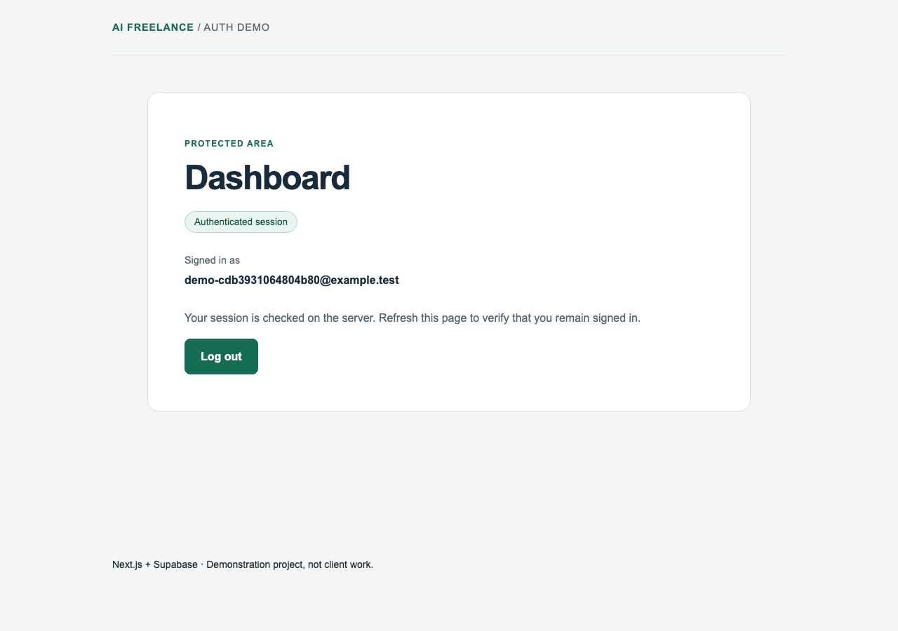

# Next.js + Supabase Authentication Troubleshooting Demo

## Purpose

Demonstration project showing a structured debugging workflow for a realistic authentication/session issue. This is a **Demonstration Project / Sample Troubleshooting Project**, not client work.

## Stack

| Technology | Validated version |
| --- | --- |
| Node.js | 24.x (tested with 24.14.1) |
| Next.js | 16.3.4 |
| React | 19.2.8 |
| TypeScript | 5.9.3 |
| Supabase JS / SSR | 2.116.0 / 0.12.7 |
| Playwright | 1.63.0 |
| ESLint | 9.39.5 |

Standard Next.js application, Vercel-ready. Use the committed lockfile. Node is declared in `.nvmrc` and `package.json`. No public deployment is claimed.

## Features

- Signup and required email confirmation.
- Password login and validation errors.
- Server-protected dashboard.
- Session renewal and browser cookie persistence.
- Logout and denial of subsequent unauthenticated access.
- Responsive desktop and mobile interface.

Server Actions write authentication cookies through a request-scoped SSR client. The Proxy refreshes sessions and forwards updated cookies to both the current request and the browser. The dashboard independently checks identity server-side. Cookies use HttpOnly, SameSite=Lax and Secure in production; authenticated responses use private/no-store caching.

## Troubleshooting Scenario

Initial login continued to work while renewed session cookies were not persisted in the browser. A controlled one-line regression discarded the response carrying those cookies. Removing that line restored persistence without weakening authentication.

A deterministic renewal test and separate server/browser observations isolated the missing cookie delivery. The original test stayed unchanged throughout.

See [TROUBLESHOOTING.md](TROUBLESHOOTING.md) for reproduction, evidence, root cause and fix. Historical tags preserve the working baseline, deliberate regression and verified correction.

## Screenshots



[Login](portfolio/screenshots/01-login.png) · [Baseline → broken → fixed evidence](portfolio/screenshots/03-regression-evidence.png) · [Validation results](portfolio/screenshots/04-validation.png) · [Final application](portfolio/screenshots/05-final-app.png)

The application images are real browser captures. The two evidence images are labeled summaries of actual test executions, not terminal screenshots. See [capture provenance](portfolio/EVIDENCE.md).

## Validation

- 6 unit tests.
- 6 end-to-end tests, including desktop and mobile.
- Typecheck and lint.
- Production build.

The original regression test is unchanged across all three historical states. Additional verification covered renewed cookie flags, fragment cleanup, a second reload, cache headers, logout and protected-route denial.

## Running Locally

Prerequisites: Node 24, npm, and authorized access to the dedicated Supabase test sandbox. With nvm installed:

```sh
nvm install
nvm use
npm ci
cp .env.example .env.local
```

Configure the two application variables in `.env.local`, then:

```sh
npm run dev -- --port 3007
```

Open `http://localhost:3007`. The sandbox accepts only fictional `demo-…@example.test` addresses. Confirmation is mandatory. A private PostgreSQL email hook captures codes for the authorized test runner instead of sending real email. Visitors cannot retrieve confirmation codes from the public application. This is test infrastructure, not a public signup service.

### Tests

```sh
npm run verify
npx playwright install chromium
E2E_PRODUCTION=1 npm run test:e2e
```

Stop any existing server on port 3007 before production E2E so the runner starts the newly built application. Alternatively, start the intended production build explicitly and set `E2E_BASE_URL` to its address.

The E2E runner requires management access to the dedicated sandbox. It uses `SUPABASE_ACCESS_TOKEN` supplied securely, or the Supabase CLI credential from macOS Keychain. This credential belongs only to the test process and is never imported by the application. Passwords are generated in memory. Tests remove their own fictional accounts and mailbox messages, including on failure. Traces and videos are disabled to avoid recording credentials.

The test helper has an explicit project-reference guard. A different sandbox requires deliberate provisioning and review of that guard; changing the application URL alone is insufficient. The migration and `supabase/auth-settings.json` document the private-mailbox setup. Do not reuse production data or credentials.

## Environment Variables

Application variable names:

```text
NEXT_PUBLIC_SUPABASE_URL
NEXT_PUBLIC_SUPABASE_PUBLISHABLE_KEY
```

Optional test-process variable names:

```text
SUPABASE_ACCESS_TOKEN
E2E_BASE_URL
E2E_PRODUCTION
```

`.env.local` is Git-ignored. Never commit credentials, OTPs, passwords or session cookies. The application does not require a service-role key.

## Project Status

**Demonstration Project.** The controlled fix is integrated. Portfolio presentation is under review and the repository remains private.

Validation uses a local production build with real hosted Supabase Auth, not a public HTTPS deployment. The Free sandbox excludes leaked-password checking, and the private mailbox does not test external email delivery. ESLint 9 is retained for compatibility with the installed Next.js lint configuration; reassess support when upgrading the stack.
